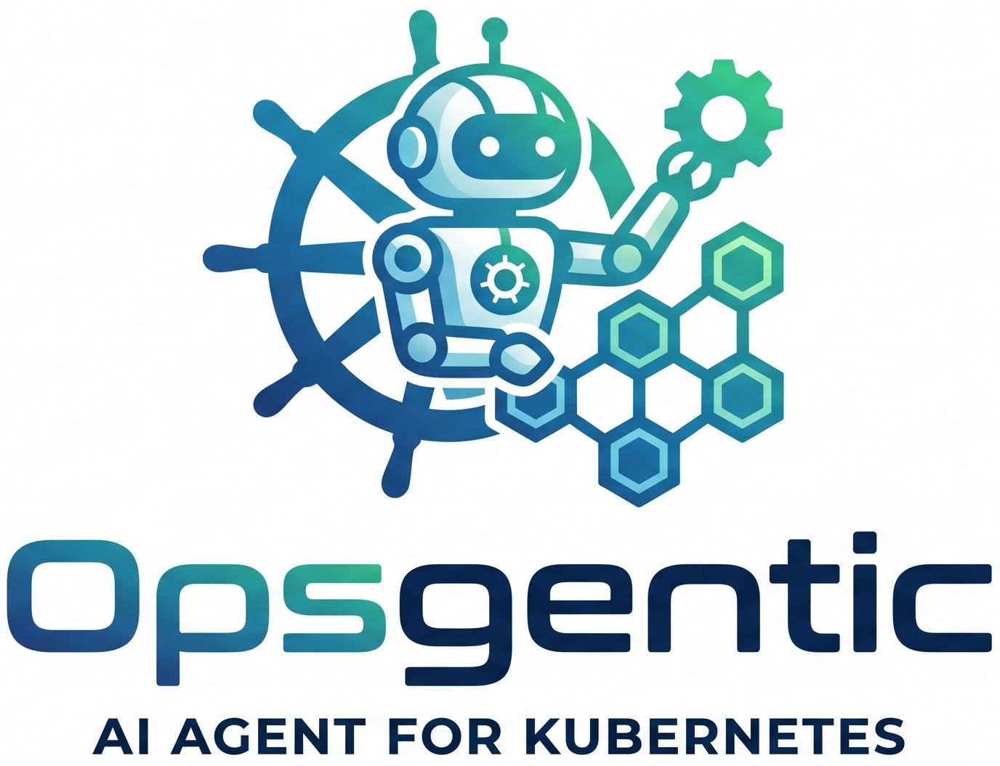
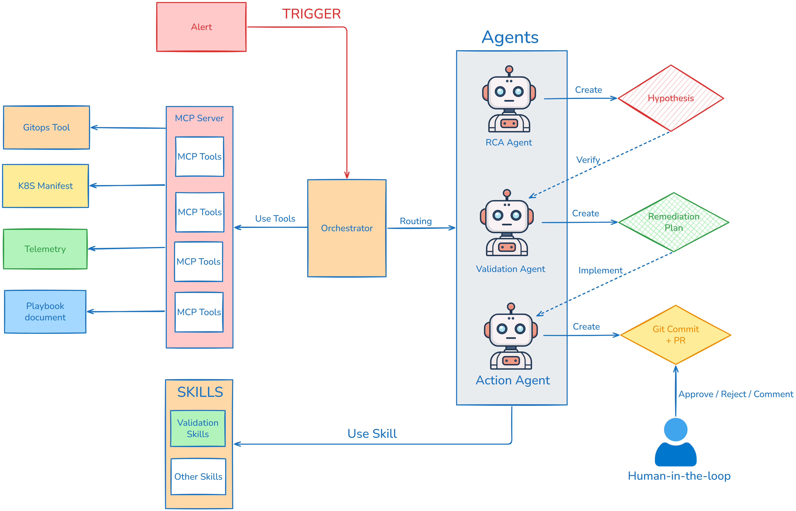

<p align="center" style="width: fit-content; margin: 0 auto; background: white;">
  
</p>

# OpsGentic

A multi-agent system for automated **Root Cause Analysis (RCA)**, **Validation**, and **Remediation** on Kubernetes. Agents are orchestrated as a stateful graph with [LangGraph](https://github.com/langchain-ai/langgraph); remediation is applied through **GitOps** with a **human-in-the-loop** approval gate before any pull request is opened (or PR review when auto-approve is on).

Triggers are handled **asynchronously**: the API enqueues a run and returns immediately with a `thread_id` to poll; a separate worker drives the graph. The LLM runs on a **local vLLM** (OpenAI-compatible) endpoint, configured entirely through environment variables.

## Architecture



A trigger (a Grafana/Alertmanager alert or a user chat message) hits the API, which **enqueues** the run on a Postgres-backed task queue and returns `202 { thread_id, status, poll_url }`. A **worker** consumes the job and runs a stateful graph across three core agents:

- **RCA Agent** — enriches context (via read-only MCP tools) and produces a root cause hypothesis.
- **Validation Agent** — verifies the hypothesis using deterministic Validation Skills, then drafts a remediation plan.
- **Action Agent** — opens a Git commit + pull request so a GitOps controller (ArgoCD/Flux) can apply the change.

Two tool layers feed the agents:

- **MCP Servers (read-only)** — reused open-source MCP servers (`kubernetes-mcp-server` for the cluster, `github-mcp-server` for the repo) for querying cluster/observability/repo state. No mutation happens here; writes only occur through GitOps.
- **Validation Skills** — plain-Python business logic the Validation Agent calls directly, independent of MCP.

Agent **instructions** are not hard-coded: each agent composes its system prompt from an editable **agent-skill** library (markdown files), see [Agent skills](#agent-skills).

The Action Agent never opens a PR autonomously: the graph pauses at an `interrupt_before` gate and waits for a human to approve or reject (unless `AUTO_APPROVE=true`, where PR review/merge becomes the gate).

## Async execution & polling

opsgentic decouples the API from the (minutes-long) agent run:

- The API **enqueues** the run on a **Postgres-backed task queue** ([Procrastinate](https://procrastinate.readthedocs.io/)) and returns `202` immediately.
- A separate **worker** Deployment consumes the queue and drives the graph, recording the lifecycle (`queued → running → awaiting_approval → applied/failed`) in an `opsgentic_runs` table.
- Clients **poll** `GET /runs/{thread_id}` for status + state.
- The queue reuses the same Postgres used for durable checkpoints — **no extra broker**, identical locally and on Kubernetes.
- Without `DATABASE_URL` (local/dev), there is no queue: the API runs the graph **synchronously in-process** and returns the full result, and the CLI runs it directly.

## Machine state & graph flow

```
trigger -> [enqueue] -> worker:  RCA -> resolve_target -> Validation -> [interrupt_before] -> Action -> END
                                            |                                  ^
                                            +-- (fail / unresolved repo) ------+ (self-heal loop)
```

1. **RCA** reads `alert_payload`, gathers `context_data`, writes `hypothesis`.
2. **resolve_target** maps the alerting workload to its GitOps repo/path (see Multi-repo resolution).
3. **Validation** runs the Validation Skills. On pass (and a resolved repo) it drafts a `remediation_plan` and sets `execution_status="awaiting_approval"`. On fail or unresolved repo it loops back to RCA up to `MAX_RCA_ATTEMPTS`, then escalates.
4. The graph **pauses before `action`** (`interrupt_before=["action"]`); state is persisted by the checkpointer keyed on `thread_id`. No PR exists yet.
5. A human approves (or `AUTO_APPROVE=true`); the run resumes and the **Action Agent** opens (or updates) the remediation PR.

## Remediation: edit the manifest, converge on re-fire

The Action Agent reads the resolved repo via `github-mcp-server` and proposes **surgical field edits** (forced via structured output), which opsgentic applies to the real manifest with comments/formatting preserved (`ruamel`). If no edits can be produced, it falls back to a `remediations/<key>.md` proposal.

A stable **issue key** (`repo|file|alertname|namespace`) drives a deterministic branch, so a re-fired alert does **not** open a duplicate PR. Instead opsgentic **converges** (GitHub):

- It reads what the open PR already proposes (the `base...branch` diff) and asks the agent whether that already resolves the alert.
- **Sufficient** → it posts one comment, no new commit.
- **Insufficient** → it commits a single incremental edit on the branch.

This avoids the divergent-commit churn that comes from regenerating a (non-deterministic) fix on every re-fire.

## Agent skills

Agent instructions live in an editable markdown library instead of hard-coded prompts:

- `deploy/manifests/agent-skills/{sre,gitops,validation,code}.md` — each has YAML frontmatter (`name`, `description`, `agents: [...]`) plus a markdown body.
- A skill is wired to agents via its `agents` field; the loader ([`agent_skills.py`](src/opsgentic/agent_skills.py)) composes the bodies of all skills targeting an agent into its system prompt. Code-bound mechanics (the remediation edit schema, the resolver index-only answer) stay in code.
- Wiring: `rca`/`context` → `sre`; `remediation` → `sre + gitops + validation + code`; `resolver` → `gitops`.
- Delivery: shipped as the `opsgentic-skills` **ConfigMap** (mounted at `/app/agent-skills`) so you can tune prompts via a manifest change + `rollout restart` — no image rebuild. A baked-in copy is the fallback. Edit a skill, `kubectl apply -k`, then `kubectl -n opsgentic rollout restart deploy/opsgentic deploy/opsgentic-worker`.

## Triggers

Both triggers normalize to the same `alert_payload` and return `202 { thread_id, status: "queued", poll_url }`:

- **Grafana / Alertmanager webhook** — `POST /webhook/grafana`
- **User chat** (operator provides error context) — `POST /chat`

Poll `GET /runs/{thread_id}`. With `AUTO_APPROVE=true`, a passing validation opens the PR automatically; otherwise the run pauses at `awaiting_approval` for `/runs/{id}/approve` (or `/ui/{id}`).

## Multi-repo resolution

opsgentic maps an alert to the GitOps repo/path that owns the affected workload, so one deployment serves many repos. Resolution chain (first match wins):

1. Explicit alert labels `gitops_repo` / `gitops_path` (override / fast path).
2. **ArgoCD** — the `Application` whose `status.resources` (or destination namespace) contains the workload → `spec.source.repoURL` + `path` + `targetRevision`.
3. **Flux** — the workload's `kustomize.toolkit.fluxcd.io/{name,namespace}` labels → `Kustomization` → `GitRepository` URL + path.
4. Unresolved → escalate (opsgentic does not guess a repo).

The workload identity is derived from alert labels (`workload`/`deployment`/`app`, or the pod name with its replicaset/pod suffix stripped). Discovery is deterministic — CRDs are read read-only through the **kubernetes-mcp-server** (MCP); when more than one source matches with equal confidence, the LLM picks among the candidates.

The resolved host selects a provider from the registry (`config/gitops.yaml`): each git host maps to a type (`github` / `gitea` / `gitlab`), an API base, and the env var holding that provider's token. For GitHub, prefer a **GitHub App** (`GITHUB_APP_ID` + `GITHUB_APP_INSTALLATION_ID` + private key): opsgentic mints short-lived installation tokens; a PAT (`GITHUB_TOKEN`) is the fallback. The App needs `Contents: Read & write` and `Pull requests: Read & write`.

## Project layout

```
src/opsgentic/
  config.py             # Settings (env-driven)
  agent_skills.py       # markdown agent-skill loader (frontmatter -> per-agent prompt)
  agents/llm.py         # ChatOpenAI factory pointing at vLLM
  graph/
    state.py            # MachineState (TypedDict)
    builder.py          # StateGraph wiring + interrupt_before
    nodes/              # rca / resolve_target / validation / action
  skills/               # deterministic Validation Skills (Python: registry + checks)
  mcp/                  # MCP loader + read-only context enrichment
  gitops/               # resolver (argocd/flux), provider registry, PR create + re-fire convergence, remediator, yamledit
  triggers/normalize.py # Grafana + chat -> alert_payload
  runner.py             # enqueue (async) + execute (sync) + status tracking
  tasks.py              # Procrastinate app + tasks (run_alert / resume_run)
  runs.py               # opsgentic_runs status table
  worker.py             # queue worker entrypoint (opsgentic-worker)
  main.py               # FastAPI service (async, 202 + polling)
  cli.py                # local runner (synchronous)
mcp-config/             # MCP server config (servers.yaml)
config/gitops.yaml      # git provider registry (host -> provider/token)
deploy/manifests/       # K8s manifests: namespace, RBAC, MCP servers, Postgres, ConfigMap/Secret,
                        #   API + worker Deployments, Service, agent-skills/ (-> ConfigMap)
examples/               # sample grafana_alert.json / chat_input.json
docs/figures/           # diagrams
```

## Quickstart

Requirements: Python 3.11+.

```bash
python -m venv .venv && . .venv/bin/activate
pip install -e .
cp .env.example .env        # then fill in vLLM / GitOps values
```

If `LLM_BASE_URL` is left empty, the agents fall back to a deterministic canned response, so the graph runs end-to-end before the LLM is configured.

### Run locally (CLI — synchronous, no queue)

```bash
opsgentic --file examples/grafana_alert.json --source grafana --approve
opsgentic --file examples/chat_input.json --source chat
```

### Run the service

```bash
opsgentic-api          # serves on :8080
```

Without `DATABASE_URL` the API runs each request synchronously in-process. With `DATABASE_URL` set, also run a worker (it consumes the queue and drives the graph):

```bash
opsgentic-worker       # consumes the Postgres queue; needs DATABASE_URL
```

## HTTP API

| Method | Path                          | Description                                                  |
| ------ | ----------------------------- | ------------------------------------------------------------ |
| GET    | `/healthz`                    | Health check                                                 |
| POST   | `/webhook/grafana`            | Grafana/Alertmanager webhook trigger → `202 {thread_id,...}` |
| POST   | `/chat`                       | User chat trigger → `202 {thread_id,...}`                    |
| GET    | `/runs/{thread_id}`           | Run status + state (`queued`/`running`/`awaiting_approval`/`applied`/`failed`) |
| POST   | `/runs/{thread_id}/approve`   | Approve the plan → `202` (resume is queued)                  |
| POST   | `/runs/{thread_id}/reject`    | Reject the plan → `202`                                      |
| GET    | `/ui/{thread_id}`             | Minimal HTML approval page (Approve/Reject)                  |

A trigger returns a `thread_id` immediately; the operator then polls `/runs/{thread_id}` and calls `approve`/`reject` (or opens `/ui/{thread_id}`).

```bash
TID=$(curl -s localhost:8080/chat -XPOST -H 'content-type: application/json' \
  -d '{"title":"t","message":"payments-api high memory","labels":{"namespace":"payments","app":"payments-api"}}' | jq -r .thread_id)
curl -s localhost:8080/runs/$TID | jq '{status, awaiting_approval, pr_url: .state.pr_url}'
```

## Configuration

| Variable           | Default       | Description                                                |
| ------------------ | ------------- | ---------------------------------------------------------- |
| `LLM_BASE_URL`     | _(empty)_     | vLLM OpenAI-compatible endpoint. Empty -> canned fallback. |
| `LLM_API_KEY`      | _(empty)_     | vLLM API key (stored in a K8s Secret when deployed).       |
| `LLM_MODEL`        | `local-model` | Model name served by vLLM.                                 |
| `LLM_TEMPERATURE`  | `0.0`         | Sampling temperature.                                      |
| `LLM_MAX_TOKENS`   | `4096`        | Max output tokens (keep well below the model context).     |
| `SKILLS_PATH`      | `agent-skills` | Agent-skill markdown library; auto-resolves `/app/agent-skills` in-cluster and `deploy/manifests/agent-skills` from the repo root. |
| `MCP_ENABLED`      | `false`       | Enable read-only MCP context enrichment + repo/cluster reads. |
| `MCP_CONFIG_PATH`  | `mcp-config/servers.yaml` | Path to the MCP servers config file.           |
| `MCP_RECURSION_LIMIT` | `25`       | ReAct step cap for the MCP agents.                         |
| `GIT_CONFIG_PATH`  | `config/gitops.yaml` | Provider registry (host -> type/api_base/token_env). |
| `GITHUB_APP_ID` / `GITHUB_APP_INSTALLATION_ID` | _(empty)_ | GitHub App auth (preferred — mints installation tokens). |
| `GITHUB_APP_PRIVATE_KEY_PATH` | _(empty)_ | Path to the App private key `.pem` (or inline `GITHUB_APP_PRIVATE_KEY`). |
| `GITHUB_TOKEN` / `GITEA_TOKEN` / `GITLAB_TOKEN` | _(empty)_ | Per-provider bot tokens (PAT). |
| `GITHUB_MCP_TOKEN` | _(empty)_     | Read-only token for the self-hosted `github-mcp-server`.   |
| `MAX_RCA_ATTEMPTS` | `2`           | Self-heal loop cap before escalation.                      |
| `AUTO_APPROVE`     | `false`       | `true` opens the PR automatically (no human approve step). |
| `DATABASE_URL`     | _(empty)_     | Postgres DSN. Enables durable checkpoints **and** the task queue (async API + worker). Empty -> in-memory + synchronous in-process API. |
| `DB_POOL_MAX_SIZE` | `10`          | Postgres connection pool size.                             |
| `LOG_LEVEL`        | `INFO`        | Log level.                                                 |

Secrets are never committed: `.env` is gitignored and mapped to a Kubernetes Secret at deploy time.

## Docker

```bash
docker build -t opsgentic:dev .
docker run --rm -p 8080:8080 --env-file .env opsgentic:dev          # API
docker run --rm --env-file .env opsgentic:dev opsgentic-worker       # worker (needs DATABASE_URL)
```

## Deploy to Kubernetes

```bash
kubectl apply -k deploy/manifests/        # namespace, read-only RBAC, MCP servers, Postgres,
                                          #   ConfigMap (+ agent-skills), API + worker Deployments, Service
```

Always use `-k` (kustomize), not `-f`: the base relies on a `configMapGenerator` (agent skills) and on `images:` to set the app image. Real secrets come from a Secret managed out of band (Sealed/External Secrets); `secret.example.yaml` is a template, and the actual `secrets.yaml` is gitignored.

- **App image** is set once in `kustomization.yaml` (`images:` maps the logical name `opsgentic` → registry + tag). Bump `newTag` to roll a new build for both the API and worker.
- **Postgres** (`deploy/manifests/postgres/`) backs durable checkpoints and the task queue. The worker bootstraps the queue + `opsgentic_runs` schema on startup (idempotent).
- **Worker** (`opsgentic-worker` Deployment) consumes the queue; scale it independently. The API only enqueues.
- The read-only ClusterRole is bound to the `kubernetes-mcp` ServiceAccount; the `kubernetes-mcp-server` is the **only** component with cluster API access (read-only by RBAC + `--read-only`). opsgentic reaches the cluster solely through it and needs no cluster RBAC.

## Status & roadmap

- **M1 (done)** — runnable skeleton: LangGraph orchestrator, three agent nodes, Validation Skills, both triggers, `interrupt_before` approval gate, FastAPI + CLI.
- **M2 (done)** — read-only MCP (`kubernetes-mcp-server`) wired into RCA; read-only RBAC; `deploy/manifests/`.
- **M3 (done)** — durable checkpointing (`PostgresSaver`) with a deployed Postgres; real PR creation; minimal HTML approval page.
- **Multi-repo (done)** — alert→repo discovery via ArgoCD + Flux CRDs (LLM tiebreak on ties); multi-provider PR/MR (GitHub, Gitea, GitLab).
- **Agentic remediation (done)** — a read-only agent reads the repo via `github-mcp-server`, proposes manifest edits via **structured output**; opsgentic applies them (proposal-markdown fallback). GitHub authenticates as a GitHub App.
- **Re-fire convergence (done)** — a re-fired alert evaluates the open PR's diff and either comments (sufficient) or commits one incremental edit, instead of churning divergent commits.
- **Agent skills (done)** — editable markdown skill library composed into each agent's prompt; delivered via ConfigMap.
- **Async API (done)** — Postgres-backed task queue (Procrastinate) + separate worker; triggers return `202` + `thread_id` for polling.
- **M4** — automatic triggering from Grafana/Alertmanager (wired in the demo); deeper validation skills; observability/tracing; worker autoscaling.

## Notes

- **Always deploy with `kubectl apply -k deploy/manifests/`.** `-f` skips kustomize (no agent-skills ConfigMap, no image substitution, and it would try to apply `kustomization.yaml`/templates).
- **Checkpointing & queue:** `DATABASE_URL` enables both the durable `PostgresSaver` and the task queue. Without it, state is in-memory and the API runs synchronously (fine for dev; single process, lost on restart).
- All cluster access goes through the read-only `kubernetes-mcp-server` (MCP) — no direct Kubernetes client, no kubectl. All changes flow through GitOps pull requests, gated by human approval (or PR review when `AUTO_APPROVE=true`). opsgentic only **opens/updates** the PR; a GitOps controller (ArgoCD/Flux) applies the change after merge. Without a controller, set `gitops_repo`/`gitops_path` labels on alerts, then merge and apply yourself.
- Repeated alerts don't duplicate PRs: a stable issue key drives a deterministic branch; a re-fired alert converges on the existing open PR (comment or one incremental commit).
- Agent skills are read once at startup and cached, so edits take effect after a `rollout restart` (and, for the baked-in copy, an image rebuild).
