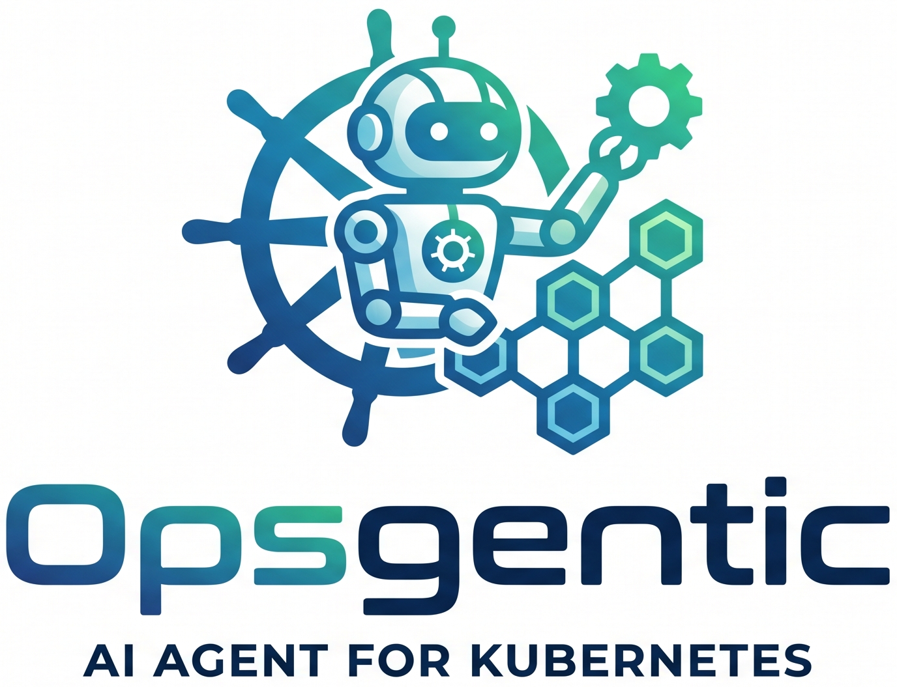

# 🤖 OpsGentic — AI Agents for DevOps Automation

<p align="center" style="width: fit-content; margin: 10 auto; background: white;">
  
</p>

<p align="center">
  <b>Self-healing Kubernetes with AI agents.</b><br/>
  OpsGentic turns an alert into a reviewed GitOps pull request — automated <b>Root Cause Analysis</b>, <b>Validation</b>, and <b>Remediation</b>, with a human in the loop.
</p>

<p align="center">
  <a href="https://lehuannhatrang.github.io/opsgentic/"></a>
  
  
  
  
  
  <a href="LICENSE"></a>
  
</p>

<p align="center">
  🌐 <b><a href="https://lehuannhatrang.github.io/opsgentic/">Website &amp; Documentation</a></b>
  &nbsp;·&nbsp; <a href="QUICKSTART.md">Quickstart</a>
  &nbsp;·&nbsp; <a href="docs/ARCHITECTURE.md">Architecture</a>
  &nbsp;·&nbsp; <a href="https://github.com/lehuannhatrang/opsgentic">GitHub</a>
</p>

---

> **Alert fires → agents find the root cause → propose a minimal manifest fix → open a PR on your GitOps repo → you approve → ArgoCD/Flux applies it.** 

> No kubectl, no manual patching.

**OpsGentic** is an open-source **AIOps / agentic SRE** platform for **Kubernetes incident response
and auto-remediation**. A multi-agent [LangGraph](https://github.com/langchain-ai/langgraph)
pipeline performs automated **root cause analysis** on Prometheus/Alertmanager alerts (or a chat
message), then remediates **through GitOps** — every change is a reviewable pull request opened on
your **ArgoCD/Flux** repo, never a live `kubectl` mutation. Think of it as an **AI SRE agent** that
turns alerts into self-healing infrastructure, with a human in the loop.

## ✨ Why OpsGentic

- 🧠 **Multi-agent RCA → Validation → Remediation** — a stateful LangGraph graph, not a single prompt.
- 🔧 **Auto-remediation as code** — proposes surgical manifest edits and opens a **GitOps PR** (ArgoCD/Flux applies after merge).
- 🙋 **Human-in-the-loop** — pauses for approval before any PR (or PR review when auto-approve is on).
- 🔒 **Read-only by design** — all cluster/repo reads go through [MCP](https://modelcontextprotocol.io/) servers; no direct k8s client, no kubectl. Writes happen only via Git.
- 🔁 **GitOps-native & multi-repo** — discovers the owning repo from ArgoCD/Flux; GitHub / GitLab / Gitea.
- ♻️ **Convergent** — a re-fired alert updates the existing PR (comment or one incremental commit) instead of stacking duplicates.
- ⚡ **Async** — the API enqueues and returns a `thread_id` to poll; a worker drives the run.
- ✍️ **Editable agent skills** — tune agent behavior via markdown prompts (a ConfigMap), no rebuild.
- 🐥 **Argo Rollouts canary analysis** — judges a canary as the agent behind [`rollouts-plugin-metric-ai`](https://github.com/argoproj-labs/rollouts-plugin-metric-ai); a deterministic PromQL pre-check keeps a healthy rollout free of LLM cost, and every uncertain path promotes rather than aborting.
- 🧭 **Editable pipeline blueprint** — the agent graph (nodes, routing, per-agent tool wiring) is declared in [`config/pipeline.yaml`](config/pipeline.yaml); reshape the workflow by editing YAML, not Python.
- 🧩 **Bring your own LLM** — any OpenAI-compatible endpoint (local **vLLM**, etc.), env-configured.

## 🧩 How it works

```
Prometheus/Alertmanager ─alert─▶ OpsGentic API ─enqueue─▶ Worker
                                                            │  RCA → Validation → [approve] → Action
   ArgoCD/Flux ◀─sync─ merge ◀─ Pull Request ◀──────────────┘
```

1. A Grafana/Alertmanager webhook (or `POST /chat`) is **enqueued**; the API returns `202 { thread_id }`.
2. The worker runs **RCA** (root-cause hypothesis) → **Validation** (deterministic checks) → **Action**.
3. Action reads the GitOps repo (read-only via MCP), proposes a **minimal manifest edit**, and opens a **PR**.
4. You approve (or auto-approve); ArgoCD/Flux applies the merged change.

Deep dive: **[docs/ARCHITECTURE.md](docs/ARCHITECTURE.md)**.

## 🧭 Editing the pipeline (blueprint)

The agent graph is **declarative**. Nodes, routing, and per-agent tool wiring live in
[`config/pipeline.yaml`](config/pipeline.yaml), not in Python. Clone the repo, edit that file,
and restart — the graph is rebuilt from the blueprint on startup.

```yaml
# config/pipeline.yaml (agents section abbreviated)
entrypoint: rca
interrupt_before:
  - action                     # human-in-the-loop gate before opening a PR
nodes:
  - id: rca
    step: rca
    agents: [context, rca]
  - id: resolve_target
    step: resolve_target
    agents: [resolver]
  - id: validation
    step: validation
    agents: [validation]
  - id: action
    step: action
    agents: [remediation]
edges:
  - from: rca
    to: resolve_target
  - from: resolve_target
    to: validation
  - from: validation
    route: after_validation    # named router -> conditional edge
    branches:
      action: action
      rca: rca
      escalate: END
  - from: action
    to: END
agents:
  context:
    tools: [kubernetes, prometheus]
  remediation:
    tools: [kubernetes, github, prometheus]
  # rca / resolver / validation reason without MCP tools -> tools: []
```

- **Reshape the workflow** — add / remove / reorder `nodes`, rewrite `edges`, or change an
  agent's `tools` in YAML. `step` binds a node to a built-in implementation; `route` binds a
  conditional edge to a named router; `END` is the graph terminal.
- **Add a genuinely new agent** — register its node function in
  [`src/opsgentic/pipeline/registry.py`](src/opsgentic/pipeline/registry.py) (`STEP_REGISTRY`),
  or a new router in `ROUTER_REGISTRY`, then reference it by name from the YAML. That is the only
  Python you write to extend the graph.
- **Validated on startup** — an unknown `step` / `route`, a dangling edge target, or a node whose
  agent has no `agents:` entry fails fast with a clear `PipelineSpecError`.
- **One source of truth** — the runtime graph and the console graph view are both built from this
  file, so what the console shows is what runs.

Inspect and validate the blueprint from the CLI:

```bash
opsgentic pipeline show                  # print the active topology
opsgentic pipeline validate              # validate config/pipeline.yaml (exit 1 on error)
opsgentic pipeline validate my.yaml      # validate a specific file
```

**Example — add a `notify` node after `action`:**

1. Register the step in [`src/opsgentic/pipeline/registry.py`](src/opsgentic/pipeline/registry.py):
   ```python
   def notify_node(state: MachineState) -> dict:
       ...                                   # your logic; returns partial state
   STEP_REGISTRY = {..., "notify": notify_node}
   ```
2. Wire it in `config/pipeline.yaml`:
   ```yaml
   nodes:
     - id: notify
       step: notify
       agents: []
   edges:
     - from: action
       to: notify          # replaces: action -> END
     - from: notify
       to: END
   ```
3. Run `opsgentic pipeline validate`, then restart. `opsgentic pipeline show` reflects the new graph.

Agent *behavior* (prompts) is tuned separately in the editable agent-skill library — see
[USAGE.md → Editing agent skills](docs/USAGE.md#editing-agent-skills).

## 🚀 Quick start

**One-command demo** — provisions the cluster (or a local k3d/minikube/kind), ArgoCD, Prometheus,
the demo apps, and opsgentic; forks the demo repo for you and only asks for a GitHub PAT:

```bash
./hack/demo-up.sh        # idempotent; ./hack/demo-down.sh to tear it down
```

**Local dev** — no cluster, just the graph:

```bash
python -m venv .venv && . .venv/bin/activate
pip install -e .
cp .env.example .env          # set LLM_BASE_URL / LLM_API_KEY (empty = canned fallback)

# try the full graph locally (synchronous, no cluster needed)
opsgentic --file examples/grafana_alert.json --source grafana --approve
```

Full walkthrough — one-command demo, local dev, and the manual end-to-end Kubernetes path
(GitHub auth, ArgoCD, Alertmanager webhook, `bootstrap.sh`): **[QUICKSTART.md](QUICKSTART.md)**.

## 📚 Documentation

| Doc | What's inside |
| --- | --- |
| [Website](https://lehuannhatrang.github.io/opsgentic/) | Project homepage & docs hub |
| [QUICKSTART.md](QUICKSTART.md) | Install & run — dev + Kubernetes, GitHub auth, ArgoCD, Alertmanager webhook, troubleshooting |
| [docs/USAGE.md](docs/USAGE.md) | HTTP API, triggers, full configuration reference, editing agent skills, deploy |
| [docs/ARCHITECTURE.md](docs/ARCHITECTURE.md) | Agents, async queue/worker, graph flow, remediation & convergence, multi-repo resolution |

## 🗺️ Roadmap

- ✅ Multi-agent RCA / Validation / Remediation on LangGraph, human-in-the-loop gate
- ✅ Read-only MCP gateway (kubernetes-mcp-server, github-mcp-server); no kubectl
- ✅ Agentic GitOps remediation (manifest edits) + re-fire convergence; GitHub / GitLab / Gitea
- ✅ Durable checkpoints + async task queue (Procrastinate/Postgres) + worker
- ✅ Editable agent-skill prompt library (ConfigMap)
- ✅ Declarative pipeline blueprint — graph topology & tool wiring in `config/pipeline.yaml`
- ✅ Argo Rollouts canary analysis — promote/abort verdict + optional revert PR, via the argoproj-labs AI metric plugin
- ⏳ Deeper validation skills; observability/tracing; worker autoscaling

## ❓ FAQ

**What is OpsGentic?**
An open-source AI agent for Kubernetes incident response. It reads Prometheus/Alertmanager alerts,
runs automated root cause analysis with a multi-agent LangGraph pipeline, and opens a GitOps pull
request with a minimal manifest fix — self-healing Kubernetes with a human in the loop.

**How does OpsGentic remediate incidents without `kubectl`?**
It never mutates the cluster directly. All cluster and repo reads go through read-only MCP servers,
and every change is written as a pull request on your GitOps repo, which ArgoCD or Flux applies
after merge.

**Which LLMs does it support?**
Any OpenAI-compatible endpoint — a self-hosted **vLLM** server, OpenAI, or other compatible APIs —
configured via environment variables.

**Does it work with ArgoCD and Flux?**
Yes. OpsGentic is GitOps-native and multi-repo: it discovers the owning repository from your
ArgoCD/Flux Applications and supports GitHub, GitLab, and Gitea.

**How do I try it quickly?**
Run `./hack/demo-up.sh` for a one-command demo (cluster + ArgoCD + Prometheus + demo apps), or use
the local-dev path with no cluster. See the **[Quickstart](QUICKSTART.md)**.

## 🤝 Contributing

Issues and PRs are welcome. Licensed under **[Apache 2.0](LICENSE)**.
Website & docs: **https://lehuannhatrang.github.io/opsgentic/**

---

<sub>Keywords: Kubernetes · Kubernetes incident response · SRE · DevOps · AIOps · AI SRE agent · AI agent · agentic AI · multi-agent · LLM · vLLM · LangGraph · MCP · Model Context Protocol · auto-remediation · self-healing Kubernetes · self-healing infrastructure · root cause analysis · RCA · GitOps · ArgoCD · Flux · Prometheus · Alertmanager · alert remediation · incident response automation · pull request automation</sub>

